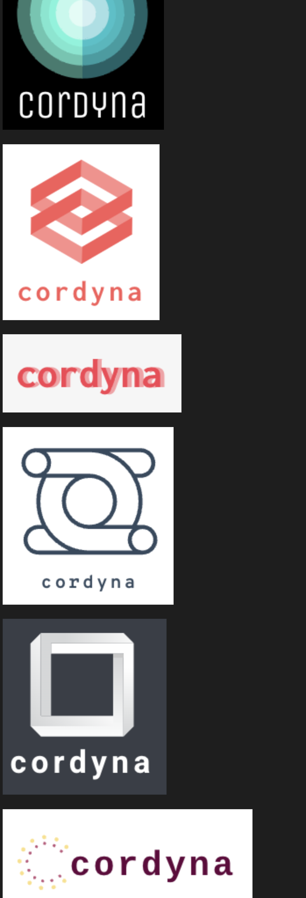

# YetAnotherProjectWithoutName

i (thomas) have a clear preference 

## Mission Plan:
create a clear distinction for test cases:

- cerebro server
- task server a (with independent workloads)
- task server b (with dependent workloads on server-a)

continuously test:
- graphbuilding capabilities of cerebro
- sends invocation-commands (events) in correct order to correct task-servers
- upon failure, still invokes anything that's not blocked by the failure
- cerebro waits for servers to report back on task states in various intervals
    - upon invocation command: 10 sec for "acknowledged" / "task-started"
    - upon "acknowledged": 10 min for "task-started"
    - upon "task-started": 30 min for "task-completed"

## Vocab/Lingo
- run vs invoke: cerebro '*invokes*': it sends an event that tells a task-server to '*run*' a task

